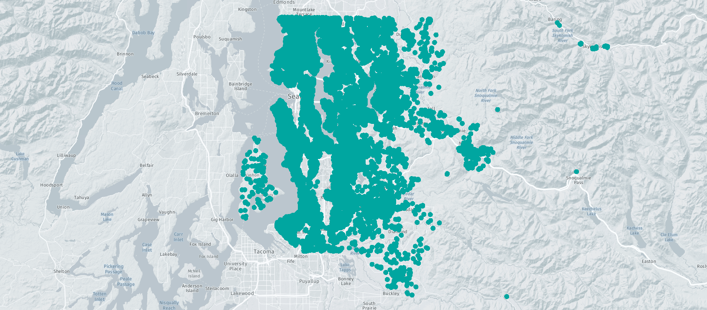

# Online Real Estate Appraisal Estimator & Location Features Experiments

## Domain Background

Real estate (RE) appraisal calculation is a necessary process for buying or selling a property. The more accurate appraisals are mainly done by RE agents by comparing nearby REs and their previous transaction values. Governments also state minimum selling prices per square meter for each region.

RE agents are mainly focusing on the following features while determining the appraisal for a RE:

* RE features (size, room count, condition, elevator, garage, etc.)
* RE location features (min. distances to transportation, schools, sports facilities and other related POIs)
* Selling prices of the RE and nearby REs in the previous 3 or 6 months.

The RE industry is worth [$277 trillion](https://techcrunch.com/2020/12/03/this-is-a-good-time-to-start-a-proptech-company/) (1) over the world and Machine Learning is a well-known and perfectly matched technology that can help the RE appraisal process. Some of the most famous RE websites in the US like https://www.zillow.com/ started using ML techniques and showing the estimated value to their users.

## Problem Statement

Estimating a RE selling price for a given location and significant features by using previously sold REs data in that region for a specified date (e.g. 2015).

While solving this problem we should also answer the following questions:

1) What are the significant features 

2) Measuring the estimation accuracy

Since RE data also contain the sold date value, we should consider this problem as a time series problem. 
Since the data I found for this project was collected between 2014 and 2015, I will ignore the sold date values and consider the problem as a simple regression problem.

### Datasets and Inputs

["2014-15 Home Sales in King County, WA"](https://geodacenter.github.io/data-and-lab/KingCounty-HouseSales2015/) dataset is used in the project. 
The dataset has 21,613 items which contain location, home sales price and characteristics of the REs. 
There are 21 features: 

<table>
  <tr>
   <td><strong>Variable</strong>
   </td>
   <td><strong>Description</strong>
   </td>
  </tr>
  <tr>
   <td>id
   </td>
   <td>Unique ID for each home sold
   </td>
  </tr>
  <tr>
   <td>date
   </td>
   <td>Date of the home sale
   </td>
  </tr>
  <tr>
   <td>price
   </td>
   <td>The price of each home sold
   </td>
  </tr>
  <tr>
   <td>bedrooms
   </td>
   <td>Number of bedrooms
   </td>
  </tr>
  <tr>
   <td>bathrooms
   </td>
   <td>Number of bathrooms, where .5 accounts for a room with a toilet but no shower
   </td>
  </tr>
  <tr>
   <td>sqft_liv
   </td>
   <td>Square footage of the apartment interior living space
   </td>
  </tr>
  <tr>
   <td>sqft_lot
   </td>
   <td>Square footage of the land space
   </td>
  </tr>
  <tr>
   <td>floors
   </td>
   <td>Number of floors
   </td>
  </tr>
  <tr>
   <td>waterfront
   </td>
   <td> A dummy variable for whether the apartment was overlooking the waterfront or not. ‘1’ if the property has a waterfront, ‘0’ if not.
   </td>
  </tr>
  <tr>
   <td>view
   </td>
   <td>An index from 0 to 4 of how good the view of the property was
   </td>
  </tr>
  <tr>
   <td>condition
   </td>
   <td>Condition of the house ranked from 1 to 5
   </td>
  </tr>
  <tr>
   <td>grade
   </td>
   <td>Classification by construction quality refers to the types of materials used and the quality of workmanship. Buildings of better quality (higher grade) cost more to build per unit of measure and command a higher value. An index from 1 to 13, where 1-3 falls short of building construction and design, 7 has an average level of construction and design, and 11-13 has a high-quality level of construction and design.
   </td>
  </tr>
  <tr>
   <td>sqft_above
   </td>
   <td>The square footage of the interior housing space that is above ground level
   </td>
  </tr>
  <tr>
   <td>sqft_basmt
   </td>
   <td>The square footage of the interior housing space that is below ground level
   </td>
  </tr>
  <tr>
   <td>yr_built
   </td>
   <td>The year the house was initially built
   </td>
  </tr>
  <tr>
   <td>yr_renov
   </td>
   <td>The year of the house’s last renovation. ‘0’ if never renovated
   </td>
  </tr>
  <tr>
   <td>zipcode
   </td>
   <td>5 digit zip code
   </td>
  </tr>
  <tr>
   <td>lat
   </td>
   <td>Latitude
   </td>
  </tr>
  <tr>
   <td>long
   </td>
   <td>Longitude
   </td>
  </tr>
  <tr>
   <td>squft_liv15
   </td>
   <td>The average size of interior housing living space for the closest 15 houses, in square feet
   </td>
  </tr>
  <tr>
   <td>squft_lot15
   </td>
   <td>The average size of land lots for the closest 15 houses, in square feet
   </td>
  </tr>
</table>

The data points on the map in King County, WA, US

### Solution Statement

ML Regression techniques can be used to solve this problem because we need to predict a numeric value. 

Before building the model, the data will be cleaned and significant features will be extracted. 
I will make experiments and compare the regression models listed below. 
After selecting the best model, it will be deployed by using AWS Sagemaker and connected to Amazon API Gateway by using lambda functions.

The web page will contain a user interface that the users can interact with. 
Users will be able to enter a desired house or apartment features with location info. 
Users will be able to see the RE on the map with the estimated price. The results will be calculated by using the end-points on the API.

On the map, nearby REs within the 1km range will be also displayed. 
This will help users to understand the estimated price. 
I plan to deploy another end-point on the API to achieve this.

### Benchmark Model

The Simple Linear Regression Model will be used as a benchmark model for this project. 
And I will try to hit this model with the project solution model. The solution model will be one of the models listed below:

* Polynomial Regression
* Ridge Regression
* Lasso Regression
* Principal Components Regression (PCR)
* Support Vector Regression
* Random Forest
* XGBoost
* CatBoost
* LightGBM

Benchmarking scores will be calculated by the Evaluation Metrics given below. 

### Evaluation Metrics

The Root Mean Square Error (RMSE, or it is also known as RMSD) will be used to evaluate the performance of the models:

I plan to calculate and monitor 2 more metrics:

* Mean Absolute Percentage Error (MAPE). The reason is prediction quality for this problem is actually should be independent of RE price. We should consider percentage values:

* Mean Absolute Error (MAE):

N: the number of estimated data

### Location Features Experiments 

I want to observe & measure how much the location features (latitude & longitude) are important on the RE selling price estimation. 
So, I will compare the importance of RE features vs. RE location. 

In the experiment, I will create 2 datasets:

Dataset 1: Only contains the location & price & sizes in square feet. 

Dataset 2: Does not contain any location-related features

I will choose the solution model and calculate the metric scores for these 2 datasets and analyze the results. 
If location features are more important, the model is built with 1. dataset should have less error compared to the models built with 2. dataset.

### Project Design & Plan

1) Building the model

2) User Interface

3) Experiments & Feature Eng. & Future Works

### References

(1) _Real Estate pricing with Machine Learning & non-traditional data sources_ - https://tryolabs.com/blog/2021/06/25/real-estate-pricing-with-machine-learning--non-traditional-data-sources/

(2) _RWI-GEO-RED: Real Estate Dataset _- https://en.rwi-essen.de/media/content/pages/publikationen/rwi-projektberichte/fdz_datenbeschreibung-rwi-geo-red-v1.pdf

(3) _2014-15 Home Sales in King County, WA_ - https://geodacenter.github.io/data-and-lab/KingCounty-HouseSales2015/

(4) _15 Types of Regression in data science_ - https://www.listendata.com/2018/03/regression-analysis.html

(5) _Regression Model Insights_

- https://docs.aws.amazon.com/machine-learning/latest/dg/regression-model-insights.html

(6) _Create React App_ - https://github.com/facebook/create-react-app

(7) [Uber’s Hexagonal Hierarchical Spatial Index](https://eng.uber.com/h3/) - https://eng.uber.com/h3/

(8) Cross-Validation and Hyperparameter Tuning: How to Optimise your Machine Learning Model -

https://towardsdatascience.com/cross-validation-and-hyperparameter-tuning-how-to-optimise-your-machine-learning-model-13f005af9d7d

(9) How to Train a Final Machine Learning Model - https://machinelearningmastery.com/train-final-machine-learning-model/